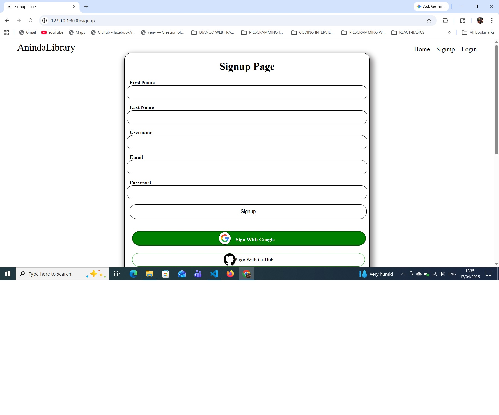
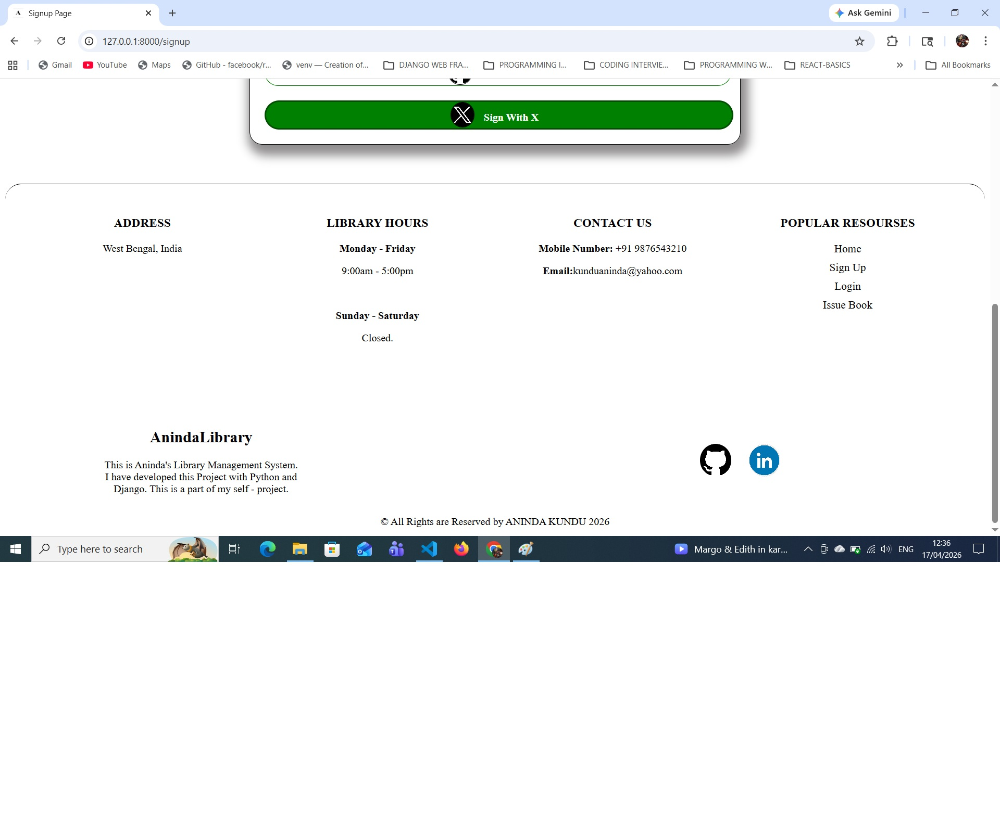
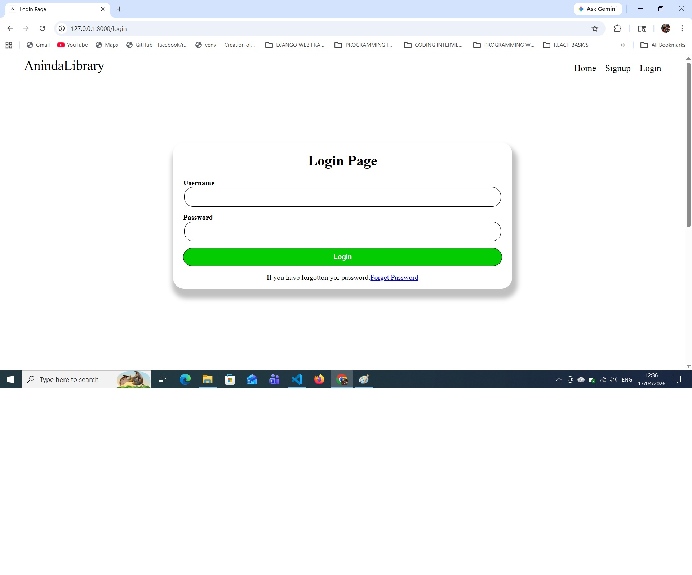
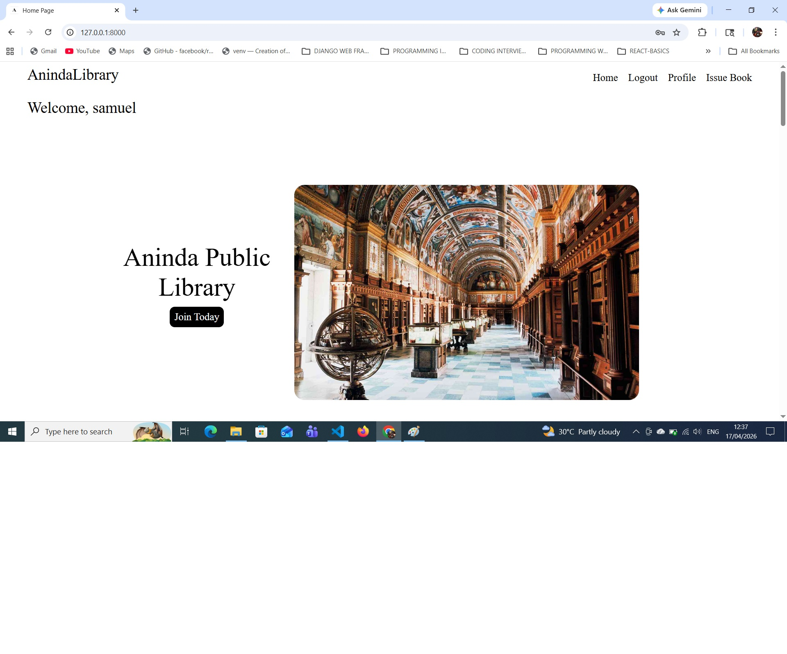
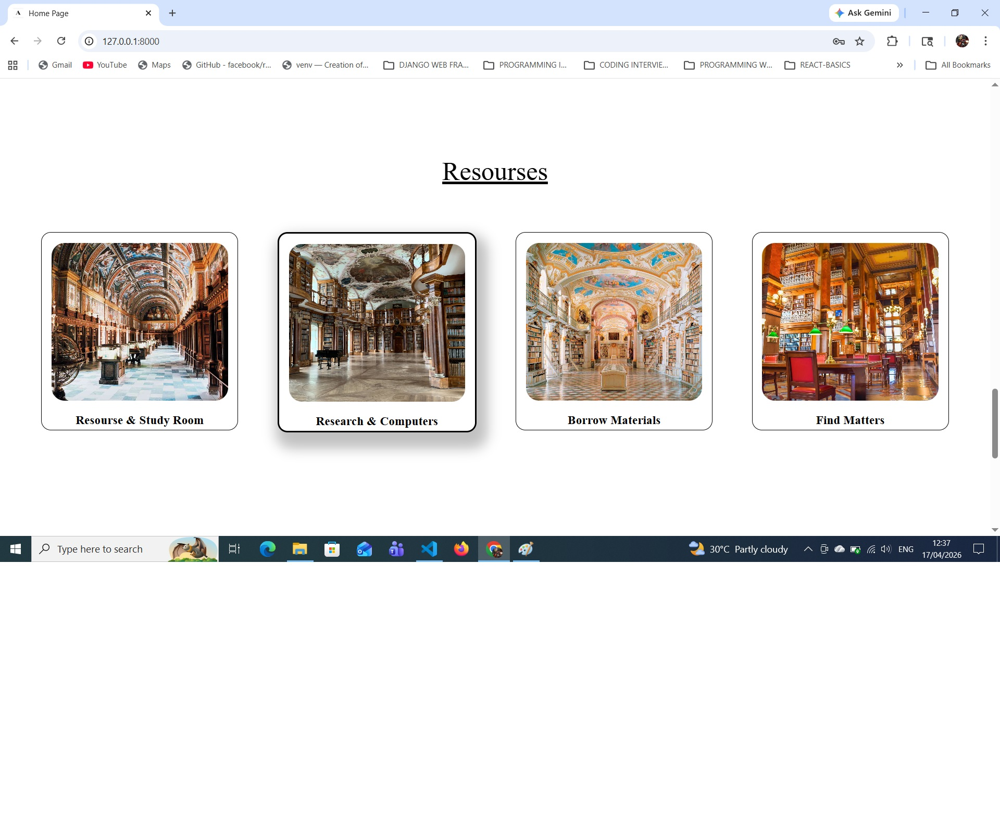
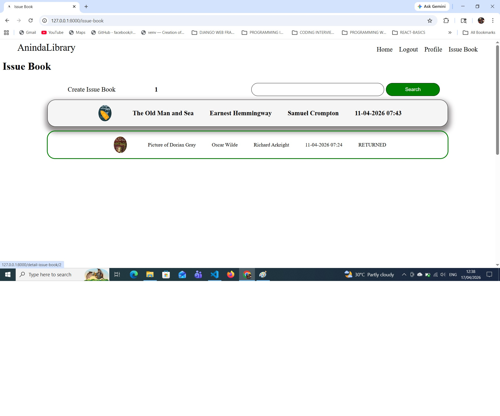
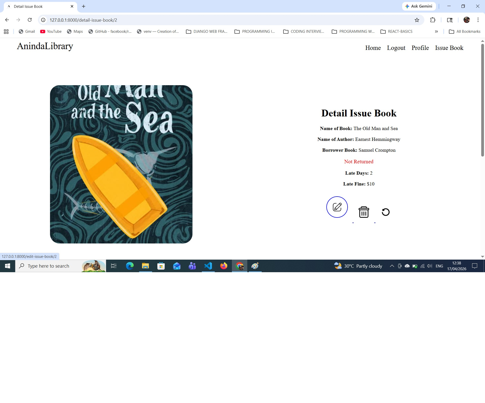
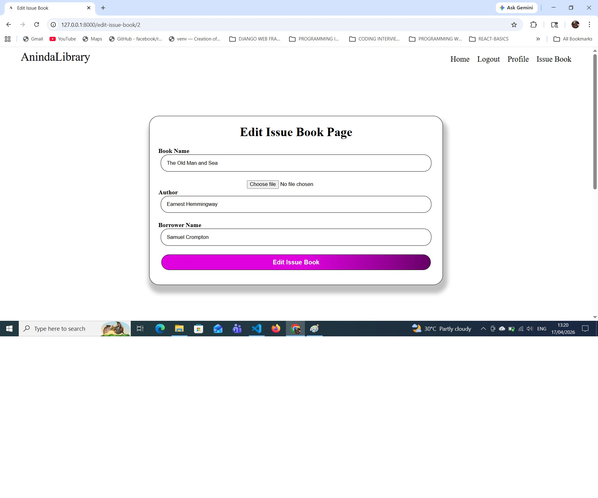

# `ANINDA's Django Library Mangement System`

This is ANINDA KUNDU's `Django Library Mangement System( Python, django )`. This project is develoeped by me with Python, Django. This project is a part of my self - project.

> This Library Management System uses `Python`, `Django`, `Django REST API`, `MySQL`, `HTML`, `CSS` & `JavaScript`.

## This Django Library Management System falls under my PRIVATE LICENSE. &copy; ALL COPYRIGHT IS RESERVED BY ANINDA KUNDU. 
 

**Some screenshots are given below for demo:** 
**Screenshot 1:**

**Screenshot 2:**

**Screenshot 3:**

**Screenshot 4:**

**Screenshot 4:**

**Screenshot 5:**

**Screenshot 6:**

**Screenshot 7:**

 

&copy; ALL RIGHTS ARE RESERVED BY ANINDA KUNDU.